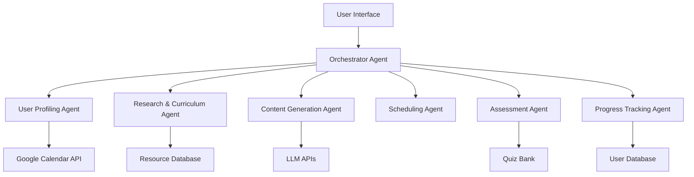

# Homework Generator - Requirements Specification
## Multi-Agent Learning System for Working Professionals

---

## 1. Executive Summary

The Homework Generator is a multi-agent AI system designed to create personalized, flexible learning paths for working professionals. It integrates with Google Calendar to intelligently schedule study sessions, generates custom learning materials, and adapts to the user's progress and availability.

---

## 2. System Overview

### 2.1 Core Value Proposition
- **Personalized Learning**: Tailored curriculum based on proficiency and goals
- **Schedule-Aware**: Integrates with work calendar for realistic planning
- **Adaptive Progress**: Adjusts difficulty and pacing based on performance
- **Resource Generation**: Creates custom materials when quality resources are unavailable
- **Continuous Assessment**: Regular knowledge checks to ensure retention

### 2.2 Target Users
- Working professionals seeking continuous learning
- Career changers requiring flexible reskilling
- Professionals preparing for certifications
- Individuals pursuing personal development alongside work

---

## 3. Multi-Agent Architecture

### 3.1 Agent Overview



### 3.2 Agent Specifications

#### 3.2.1 Orchestrator Agent
**Responsibilities:**
- Coordinates communication between all agents
- Manages workflow and data flow
- Handles error recovery and fallback strategies
- Maintains session state

**Key Functions:**
- `initialize_learning_path(user_id, topic)`
- `coordinate_agent_tasks(task_queue)`
- `handle_agent_failures(agent_id, error)`

#### 3.2.2 User Profiling Agent
**Responsibilities:**
- Calendar integration and analysis
- Proficiency assessment through adaptive questioning
- Learning preference identification
- Commitment level determination

**Key Functions:**
- `connect_google_calendar(oauth_token)`
- `analyze_calendar_patterns(calendar_data)`
- `conduct_proficiency_assessment(topic, responses)`
- `determine_commitment_level(user_input, calendar_availability)`

**Data Collection:**
```json
{
  "proficiency_assessment": {
    "topic": "string",
    "current_level": "beginner|intermediate|advanced",
    "prior_experience": ["related_topics"],
    "learning_goals": ["career", "certification", "personal"],
    "confidence_score": 0.0-1.0
  },
  "availability_analysis": {
    "weekly_free_hours": "number",
    "optimal_study_times": ["time_slots"],
    "meeting_patterns": "object",
    "energy_levels": {"time": "high|medium|low"}
  },
  "preferences": {
    "learning_style": ["visual", "auditory", "kinesthetic"],
    "content_format": ["video", "text", "interactive"],
    "session_duration": "15|30|45|60|90",
    "commitment_level": "light|moderate|intensive"
  }
}
```

**Commitment Levels:**
- **Light**: 2-4 hours/week, 15-30 min sessions
- **Moderate**: 5-8 hours/week, 30-45 min sessions  
- **Intensive**: 10+ hours/week, 45-90 min sessions

#### 3.2.3 Research & Curriculum Agent
**Responsibilities:**
- Curriculum structure generation
- Resource discovery and curation
- Learning path optimization
- Prerequisite identification

**Key Functions:**
- `generate_curriculum(topic, proficiency, commitment_level)`
- `search_quality_resources(topic, subtopic, format_preference)`
- `identify_prerequisites(topic, current_knowledge)`
- `optimize_learning_sequence(topics_list, dependencies)`

**Curriculum Structure:**
```json
{
  "curriculum": {
    "topic": "string",
    "total_duration": "weeks",
    "modules": [
      {
        "module_id": "string",
        "title": "string",
        "duration": "hours",
        "topics": ["subtopic1", "subtopic2"],
        "prerequisites": ["module_ids"],
        "learning_objectives": ["objective1"],
        "resources": [
          {
            "type": "video|article|tutorial|documentation",
            "url": "string",
            "duration": "minutes",
            "quality_score": 0.0-1.0,
            "is_generated": false
          }
        ]
      }
    ]
  }
}
```

#### 3.2.4 Content Generation Agent
**Responsibilities:**
- Generate custom learning materials when quality resources are unavailable
- Create presentation slides
- Develop practice exercises
- Generate summaries and cheat sheets

**Key Functions:**
- `generate_presentation(topic, learning_objectives, slide_count)`
- `create_practice_exercises(topic, difficulty, count)`
- `generate_study_guide(module_content)`
- `create_cheat_sheet(key_concepts)`

**Content Generation Triggers:**
- Resource quality score < 0.6
- No resources found for specific subtopic
- User requests custom materials
- Need for practice problems not available online

**Output Formats:**
- PowerPoint/Google Slides (via python-pptx)
- PDF study guides
- Interactive HTML exercises
- Markdown notes

#### 3.2.5 Scheduling Agent
**Responsibilities:**
- Intelligent lesson scheduling
- Calendar event creation (.ics generation)
- Rescheduling based on conflicts
- Reminder management

**Key Functions:**
- `generate_study_schedule(curriculum, calendar_availability)`
- `create_ics_file(schedule)`
- `handle_conflicts(new_meeting, existing_schedule)`
- `optimize_spacing(lessons, retention_curve)`

**Scheduling Algorithm:**
```python
# Pseudocode for intelligent scheduling
def schedule_lessons(curriculum, availability, preferences):
    schedule = []
    for module in curriculum.modules:
        sessions = calculate_sessions(module.duration, preferences.session_duration)
        for session in sessions:
            best_slot = find_optimal_slot(
                availability,
                energy_levels,
                existing_schedule,
                spaced_repetition_requirements
            )
            schedule.append({
                "session": session,
                "datetime": best_slot,
                "buffer_time": 15,  # minutes before/after
                "prep_materials": module.resources[:2]
            })
    return schedule
```

**Adaptive Rescheduling:**
- Monitor calendar for new conflicts
- Automatically propose alternative times
- Maintain minimum spacing between sessions
- Preserve total weekly commitment

#### 3.2.6 Assessment Agent
**Responsibilities:**
- Generate knowledge checks
- Create quizzes and assessments
- Evaluate user responses
- Recommend review sessions

**Key Functions:**
- `generate_quiz(topic, difficulty, question_count)`
- `evaluate_responses(quiz_id, user_answers)`
- `identify_knowledge_gaps(assessment_results)`
- `recommend_review_topics(gap_analysis)`

**Assessment Types:**
```json
{
  "assessment_types": {
    "quick_check": {
      "questions": 3-5,
      "duration": "5 minutes",
      "frequency": "after each session"
    },
    "module_quiz": {
      "questions": 10-15,
      "duration": "15 minutes",
      "frequency": "end of module"
    },
    "comprehensive_test": {
      "questions": 25-30,
      "duration": "30-45 minutes",
      "frequency": "curriculum milestones"
    }
  }
}
```

**Question Generation:**
- Multiple choice
- Fill in the blanks
- True/false
- Short answer
- Code completion (for technical topics)
- Case study analysis

#### 3.2.7 Progress Tracking Agent
**Responsibilities:**
- Monitor learning progress
- Adjust difficulty based on performance
- Generate progress reports
- Identify struggling areas

**Key Functions:**
- `track_session_completion(session_id, completion_data)`
- `calculate_progress_metrics(user_id)`
- `adjust_difficulty(performance_metrics)`
- `generate_progress_report(timeframe)`

**Progress Metrics:**
```json
{
  "progress_metrics": {
    "completion_rate": 0.85,
    "average_quiz_score": 0.78,
    "streak_days": 15,
    "total_study_time": "45 hours",
    "modules_completed": 8,
    "knowledge_retention": 0.82,
    "difficulty_adjustment": "+0.2",
    "predicted_completion_date": "2025-02-15"
  }
}
```

---

## 4. User Journey

### 4.1 Onboarding Flow
1. **Topic Selection**
   - User inputs desired learning topic
   - System suggests related topics/specializations

2. **Calendar Connection**
   - OAuth authentication with Google Calendar
   - Permission granted for calendar read/write

3. **Proficiency Assessment**
   - Adaptive questionnaire (5-10 questions)
   - Self-assessment of experience level
   - Learning goals identification

4. **Commitment Level Selection**
   - Choose from Light/Moderate/Intensive
   - System shows time requirement preview
   - Option to customize

5. **Preference Configuration**
   - Learning format preferences
   - Budget constraints (free/paid resources)
   - Session duration preference

### 4.2 Learning Flow
1. **Curriculum Review**
   - Display generated curriculum
   - Allow modifications/customization
   - Confirm learning path

2. **Schedule Generation**
   - System generates optimal schedule
   - User reviews and approves
   - .ics file downloaded/synced

3. **Active Learning**
   - Session reminders sent
   - Access to resources and materials
   - Complete quick assessments

4. **Progress Monitoring**
   - Dashboard shows progress
   - Receive weekly summaries
   - Celebrate milestones

---

## 5. Technical Requirements

### 5.1 System Architecture
```yaml
Backend:
  - Language: Python 3.10+
  - Framework: FastAPI
  - Database: PostgreSQL
  - Cache: Redis
  - Queue: Celery + RabbitMQ

AI/ML:
  - LLM API: OpenAI GPT-4 / Anthropic Claude
  - Embeddings: sentence-transformers
  - Resource Quality: Custom ML model

Integrations:
  - Google Calendar API
  - OAuth 2.0 authentication
  - Resource APIs: YouTube, arXiv, GitHub

Frontend:
  - Framework: React/Next.js
  - UI Library: Material-UI
  - State Management: Redux
  - Calendar Component: FullCalendar
```

### 5.2 API Endpoints
```typescript
// Core endpoints
POST   /api/users/register
POST   /api/auth/google-calendar
POST   /api/learning-paths/create
GET    /api/learning-paths/{id}
PUT    /api/learning-paths/{id}/update

// Assessment endpoints  
POST   /api/assessments/proficiency
GET    /api/assessments/quiz/{module_id}
POST   /api/assessments/submit

// Progress endpoints
GET    /api/progress/{user_id}
POST   /api/progress/session-complete
GET    /api/progress/report

// Scheduling endpoints
POST   /api/schedule/generate
GET    /api/schedule/ics/{path_id}
POST   /api/schedule/reschedule
```

### 5.3 Data Models
```python
# Core entities
class User:
    id: UUID
    email: str
    calendar_token: str
    created_at: datetime
    preferences: Dict

class LearningPath:
    id: UUID
    user_id: UUID
    topic: str
    proficiency_level: str
    commitment_level: str
    curriculum: Dict
    created_at: datetime
    status: str

class StudySession:
    id: UUID
    learning_path_id: UUID
    scheduled_time: datetime
    duration: int
    module_id: str
    resources: List[str]
    completed: bool
    completion_data: Dict

class Assessment:
    id: UUID
    learning_path_id: UUID
    type: str
    questions: List[Dict]
    user_responses: Dict
    score: float
    timestamp: datetime
```

---

## 6. Security & Privacy

### 6.1 Data Protection
- **Encryption**: All sensitive data encrypted at rest and in transit
- **OAuth Scopes**: Minimal calendar permissions requested
- **Data Retention**: User data retained for 90 days after account deletion
- **GDPR Compliance**: Right to access, modify, and delete personal data

### 6.2 Authentication & Authorization
- **JWT tokens** for session management
- **OAuth 2.0** for Google Calendar integration
- **Rate limiting** on all API endpoints
- **Input validation** and sanitization

---

## 7. Performance Requirements

### 7.1 Response Times
- Proficiency assessment: < 2 seconds per question
- Curriculum generation: < 10 seconds
- Schedule generation: < 5 seconds
- Resource search: < 3 seconds
- Content generation: < 30 seconds for slides

### 7.2 Scalability
- Support 10,000 concurrent users
- Handle 100,000 learning paths
- Process 1M API requests/day

---

## 8. Success Metrics

### 8.1 User Engagement
- **Completion Rate**: Target 60% curriculum completion
- **Active Users**: 70% weekly active users
- **Session Attendance**: 80% scheduled session attendance

### 8.2 Learning Outcomes
- **Knowledge Retention**: 75% average quiz scores
- **Progress Consistency**: 65% maintain streaks > 7 days
- **User Satisfaction**: NPS score > 50

### 8.3 System Performance
- **Uptime**: 99.9% availability
- **Resource Quality**: 85% user-rated quality score
- **Schedule Accuracy**: 90% sessions completed as scheduled

---

## 9. Future Enhancements

### Phase 2 Features
- Mobile application
- Collaborative learning (study groups)
- Employer dashboard for corporate training
- AI tutoring chatbot
- Certificate generation
- Integration with LinkedIn Learning/Coursera

### Phase 3 Features
- AR/VR learning experiences
- Peer review system
- Marketplace for user-generated content
- Advanced analytics dashboard
- Multi-language support
- Offline learning mode

---

## 10. Risk Mitigation

### 10.1 Technical Risks
- **LLM API Failures**: Implement fallback to cached content
- **Calendar Sync Issues**: Manual schedule input option
- **Resource Availability**: Maintain local resource repository

### 10.2 User Experience Risks
- **Over-ambitious Scheduling**: Include buffer time and adjustment options
- **Content Quality**: Implement user feedback and rating system
- **Burnout Prevention**: Mandatory break periods and pace monitoring

---

## Appendix A: Sample Flows

### A.1 Sample Proficiency Assessment Questions
```json
{
  "python_beginner_assessment": [
    {
      "question": "What is Python primarily used for?",
      "type": "multiple_choice",
      "options": ["Web development", "Data science", "Automation", "All of the above"],
      "follow_up_if_correct": "question_2_intermediate"
    },
    {
      "question": "Write a simple for loop that prints numbers 1-5",
      "type": "code_completion",
      "evaluation": "syntax_check"
    }
  ]
}
```

### A.2 Sample Generated Schedule
```ics
BEGIN:VCALENDAR
VERSION:2.0
PRODID:-//Homework Generator//Learning Schedule//EN
BEGIN:VEVENT
SUMMARY:Python Basics - Variables and Data Types
DTSTART:20250127T183000
DTEND:20250127T190000
DESCRIPTION:Module 1.1 - Introduction to Python variables\nPrep: Watch intro video (10 min)
LOCATION:Online
BEGIN:VALARM
TRIGGER:-PT30M
DESCRIPTION:Study session starting in 30 minutes
END:VALARM
END:VEVENT
END:VCALENDAR
```

---

## Document Version
- Version: 1.0
- Last Updated: November 2024
- Status: Final Requirements Specification