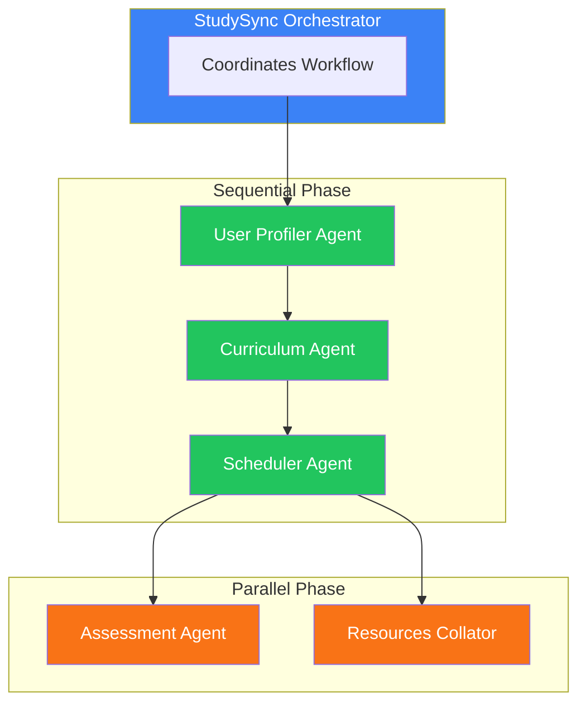

# StudySync

## AI-Powered Personalized Learning for Working Professionals

  
    Agents for Good - Education Track
  

  <a href="https://github.com/yourusername/studysync" target="_blank" class="text-xl slidev-icon-btn opacity-50 !border-none !hover:text-white">
    <carbon-logo-github />
  </a>

<!--
Hi, I'm [Your Name], and this is StudySync—an AI-powered learning system that creates personalized study plans using multiple collaborating agents.
-->

---
layout: center
class: text-center
---

# The Problem

70%

of online learners never complete their courses

<!--
Here's a problem: 70% of online learners never finish their courses. And for working professionals? It's even worse.
-->

---
layout: default
---

# Why Learning is Broken

<v-clicks>

  <h3 class="font-bold text-red-700">Information Overload</h3>
  
Millions of results. Which ones are good?

  <h3 class="font-bold text-orange-700">No Personalization</h3>
  
Generic courses ignore your existing knowledge

  <h3 class="font-bold text-yellow-700">Schedule Chaos</h3>
  
Static timelines don't fit real life

  <h3 class="font-bold text-purple-700">No Accountability</h3>
  
Easy to abandon without structure

</v-clicks>

<v-click>

Working professionals need a personal learning architect

</v-click>

<!--
Why? Because learning today is broken. Search 'learn Python' and you get millions of results. Which ones are good? Which match YOUR level?

Generic courses don't adapt to what you already know. They don't fit your schedule. And without structure, it's easy to give up.

Working professionals need something different—a personal learning architect.
-->

---
layout: center
class: text-center
---

# The Solution

StudySync

A multi-agent AI system that creates personalized learning experiences

  

    
1

    
Assess Proficiency

  

  

    
2

    
Generate Curriculum

  

  

    
3

    
Create Schedule

  

  

    
4

    
Find Resources

  

  

    
5

    
Generate Quizzes

  

  

    
6

    
Track Progress

  

<!--
StudySync is a multi-agent AI system that acts as your personal learning architect.

It assesses your proficiency, generates a custom curriculum, creates a realistic schedule, finds quality resources, generates quizzes, and tracks your progress.
-->

---
layout: default
---

# Why Agents?

This isn't a single-prompt problem. Each aspect requires specialized expertise:

<v-clicks>

  

    <carbon-user-avatar />
  

  

    
Proficiency Assessment

    
Educational psychology expertise

  

  

    <carbon-book />
  

  

    
Curriculum Design

    
Domain knowledge + pedagogy

  

  

    <carbon-calendar />
  

  

    
Scheduling

    
Constraint satisfaction

  

  

    <carbon-search />
  

  

    
Resource Discovery

    
Web search + quality evaluation

  

</v-clicks>

<v-click>

  Think of it like having a team of tutors—each an expert in their domain—working together just for you.

</v-click>

<!--
This isn't a single-prompt problem. Creating a great learning experience requires MULTIPLE types of expertise.

No single AI prompt does all of this well. So I built a team of specialized agents, each an expert in one area, coordinated by an orchestrator.

Think of it like having a team of tutors working together just for you.
-->

---
layout: default
---

# Architecture

  

    Sequential: Profile → Curriculum → Schedule
  

  

    Parallel: Assessments ∥ Resources
  

<!--
Here's how it works:

The Orchestrator coordinates everything. First, the User Profiler Agent assesses your proficiency and availability.

Then, the Curriculum Agent generates a structured learning path tailored to your level.

Next, the Scheduler Agent creates a realistic study schedule.

Finally—and this is key—the Assessment Agent and Resources Collator run in PARALLEL, generating quizzes and finding real YouTube videos and articles simultaneously.
-->

---
layout: default
---

# The Agents & Tools

  
User Profiler Agent

  <ul class="text-xs space-y-1">
    <li><code>assess_proficiency</code></li>
    <li><code>analyze_calendar_availability</code></li>
    <li><code>determine_commitment_level</code></li>
  </ul>

  
Curriculum Agent

  <ul class="text-xs space-y-1">
    <li><code>generate_curriculum</code></li>
    <li><code>get_module_resources</code></li>
    <li><code>generate_study_guide</code></li>
  </ul>

  
Scheduler Agent

  <ul class="text-xs space-y-1">
    <li><code>create_study_schedule</code></li>
  </ul>

  
Assessment Agent

  <ul class="text-xs space-y-1">
    <li><code>generate_module_quiz</code></li>
    <li><code>evaluate_quiz_responses</code></li>
    <li><code>generate_proficiency_assessment</code></li>
  </ul>

  
Resources Collator Agent

  <ul class="text-xs space-y-1 flex gap-4">
    <li><code>search_youtube_videos</code></li>
    <li><code>search_web_articles</code></li>
    <li><code>find_session_resources</code></li>
  </ul>

  15+ Custom Tools Total

<!--
Each agent has custom tools. The profiler has three tools, the curriculum agent has three, assessments has three, and resources has three more. Fifteen tools total, all working together.
-->

---
layout: center
class: text-center
---

# Demo Time

  <carbon-play-filled class="text-blue-500" />

Let's see StudySync in action

<!--
Let me show you StudySync in action.
-->

---
layout: image-right
image: https://images.unsplash.com/photo-1517694712202-14dd9538aa97?w=800
---

# Demo: Topic Selection

**Step 1:** Enter your learning topic

  
What would you like to learn?

  
Machine Learning

<!--
I enter my topic—let's say 'Machine Learning.'
-->

---
layout: image-right
image: https://images.unsplash.com/photo-1434030216411-0b793f4b4173?w=800
---

# Demo: Assessment

**Step 2:** Answer proficiency questions

  
Intermediate

  
Some experience, familiar with basic concepts

  
Q: Have you worked with Python data libraries?

  
A: Yes, NumPy and Pandas

<!--
StudySync asks me a few questions to gauge my level. I select 'Intermediate' and answer the proficiency questions.
-->

---
layout: image-right
image: https://images.unsplash.com/photo-1506784983877-45594efa4cbe?w=800
---

# Demo: Schedule Configuration

**Step 3:** Set your commitment level

  

    
Start Date

    
Dec 1, 2025

  

  

    
End Date

    
Dec 31, 2025

  

  
Moderate

  
5-8 hours/week, 30-45 min sessions

<!--
Then I set my schedule—I'll choose 'Moderate' commitment, starting next week.
-->

---
layout: default
---

# Demo: Agents at Work

Real-time progress as each agent completes its task:

<v-clicks>

  
✓

  Analyzing your learning profile...

  
✓

  Profile complete: intermediate level, moderate commitment

  
✓

  Created curriculum with 4 modules

  
✓

  Scheduled 15 study sessions

  
✓

  Generated 4 module quizzes and found resources

</v-clicks>

<!--
Now watch the agents work. You can see real-time updates: 'Analyzing profile...' 'Generating curriculum...' 'Creating schedule...' 'Finding resources...'
-->

---
layout: two-cols
---

# Demo: Dashboard

Your personalized learning path:

  

    Completion
    0%
  

  

    Sessions
    0/15
  

  

    Quizzes
    0/4
  

::right::

**Curriculum Modules:**

  

    
1. ML Fundamentals

    
4 sessions

  

  

    
2. Supervised Learning

    
4 sessions

  

  

    
3. Neural Networks

    
4 sessions

  

  

    
4. Model Evaluation

    
3 sessions

  

<!--
And here's my personalized dashboard. Four modules, fifteen study sessions, all scheduled around my availability.
-->

---
layout: default
---

# Demo: Session Resources

Each session has curated resources—**actual URLs**, not search links:

  

    <carbon-logo-youtube class="text-red-600 text-xl" />
    Video Tutorials
  

  

    

      
Introduction to Linear Regression

      
youtube.com/watch?v=...

    

    

      
ML Basics Explained

      
youtube.com/watch?v=...

    

  

  

    <carbon-document class="text-blue-600 text-xl" />
    Articles & Guides
  

  

    

      
scikit-learn Documentation

      
scikit-learn.org/...

    

    

      
Real Python Guide

      
realpython.com/...

    

  

<!--
Each session has curated resources—actual YouTube tutorials and articles, not search links.
-->

---
layout: default
---

# The Build

  

    
  

  
Google ADK

  
Agent Framework

  

    <carbon-api class="text-3xl text-green-600" />
  

  
FastAPI

  
Backend + SSE

  

    <carbon-logo-react class="text-3xl text-cyan-600" />
  

  
React + TypeScript

  
Frontend

  
LLM Integration

  
LiteLLM for OpenAI/Anthropic flexibility

  
State Management

  
ADK InMemorySessionService

  
Real-time Updates

  
Server-Sent Events (SSE)

  
Database

  
SQLite + SQLAlchemy ORM

<!--
I built this with Google ADK for the agent framework, LiteLLM for model flexibility—supporting both OpenAI and Anthropic, FastAPI for the backend with real-time SSE streaming, React and TypeScript for the frontend, and SQLite for persistence.

The agents use the ADK's sub-agent delegation pattern, with InMemorySessionService for state management across the workflow.
-->

---
layout: default
---

# Key Concepts Demonstrated

<v-clicks>

  
1

  
Multi-Agent System

  
6 LLM-powered agents

  
2

  
Sequential Agents

  
Profile → Curriculum → Schedule

  
3

  
Parallel Agents

  
asyncio.gather()

  
4

  
Custom Tools

  
15+ specialized tools

  
5

  
Sessions & State

  
InMemorySessionService

  
6

  
Observability

  
Real-time logging & SSE

</v-clicks>

<!--
StudySync demonstrates six key concepts from the course: multi-agent systems, sequential coordination, parallel execution, custom tools, session management, and observability.
-->

---
layout: center
class: text-center
---

# StudySync

Multi-agent AI for personalized learning

Making personalized education accessible to everyone—experiences that were previously only available through expensive private tutoring.

  <a href="https://github.com/yourusername/studysync" class="px-6 py-3 bg-blue-600 text-white rounded-lg hover:bg-blue-700">
    View on GitHub
  </a>

  Built during Google & Kaggle 5-Day AI Agents Intensive

<!--
StudySync shows how multi-agent systems can solve real problems in education—creating personalized learning experiences that were previously only available through expensive private tutoring.

Thanks for watching!
-->
